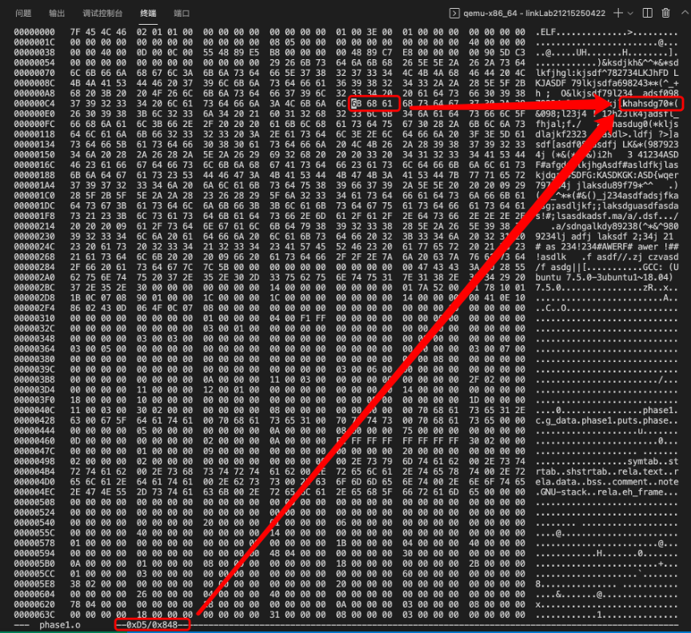
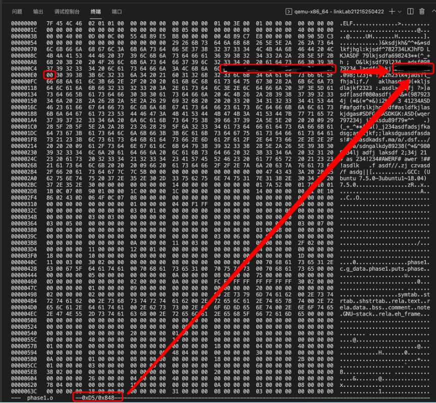

# Phase 1

首先使用gcc对main.o及phase1.o完成链接，运行lb1，可以发现输出为一串固定的随机字符串。

```log
root@51266e23cd7a:~/linkLab<stu_number>_origin# gcc -o lb1 main.o phase1.o -no-pie
root@51266e23cd7a:~/linkLab<stu_number>_origin# ./lb1 
khahsdg70*(&098;l23j4 !`12h23lk4jadsfl_fhjal;f./   aklhasdug0(*kljsdlajkf2323 :.asdl>.ldfj ?>]asdf[asdf080asdfj LK&*(9879234j (*&(*^*&)i2h   3 41234ASDF#afgdfslkjhgAsdf#asldfkjlaskjdgas#SDFG:KASDKGK:ASD{wqer797234j jlaksdu89f79*^^        )(_+_^**(#&()_j234asdfadsjfkadsg;asdljkf;;laksdguasdfasdas!#;lsasdkadsf.ma/a/.dsf.../         a/sdngalkdy89238(^*&^9809234lj adfj laksdf 2;34j 21 # as 234!234#AWERF# awer !##!asdlk        f asdf//.zj czvasd/f asdg||[
```

要使运行时只输出学号，需要找到字符串所对应的位置，以及对其进行修改。

使用readelf对phase1.o进行分析，可以发现可重定位文本段包含两个条目。

```log
Section Headers:
  [Nr] Name              Type             Address           Offset
       Size              EntSize          Flags  Link  Info  Align
  [ 0]                   NULL             0000000000000000  00000000
       0000000000000000  0000000000000000           0     0     0
  [ 1] .text             PROGBITS         0000000000000000  00000040
       0000000000000014  0000000000000000  AX       0     0     1
  [ 2] .rela.text        RELA             0000000000000000  00000448
       0000000000000030  0000000000000018   I      10     1     8
  [ 3] .data             PROGBITS         0000000000000000  00000060
       0000000000000238  0000000000000000  WA       0     0     32

Relocation section '.rela.text' at offset 0x448 contains 2 entries:
  Offset          Info           Type           Sym. Value    Sym. Name + Addend
000000000005  00080000000a R_X86_64_32       0000000000000000 g_data + 75
00000000000d  000a00000002 R_X86_64_PC32     0000000000000000 puts - 4
```

其中第一个条目对应的数据便是输出内容，位置为0x60+0x75=0xd5，使用hexedit对比可以发现是一致的。



所以，将学号所对应的ASCII文本十六进制表示覆盖到这个位置即可，最后需要使用“\0”作为结束符。

修改结果如下所示：



最后编译运行即可。

```log
root@51266e23cd7a:~/linkLab<stu_number># ./linkbomb1 
<stu_number>
```
